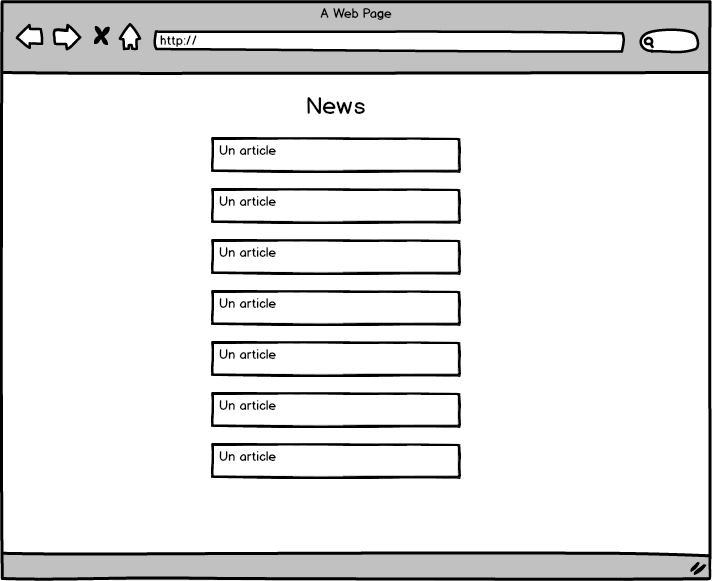
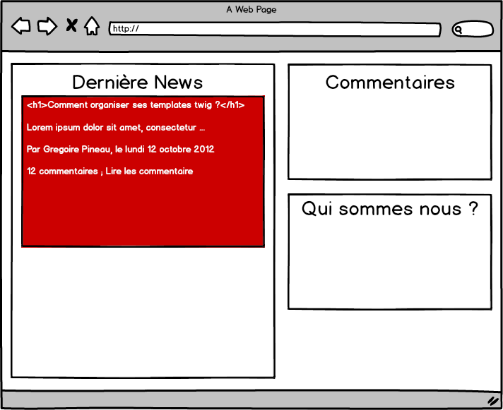

% A la découverte de Twig
% Grégoire Pineau
% 2015-10-06

------------------

# Sommaire

1. Qu'est-ce que twig ?
1. Comment sa marche ?
1. Comment organiser ses templates ?

------------------

# Qu'est-ce que Twig?

------------------

## C'est ca:


## Mais c'est aussi

* Un moteur de template [open source](https://github.com/twigphp/Twig)
* 2011-03-27: v1.0.0
* 2015-10-06: v1.22.2
* **BC depuis la v1.0.0**

## Que beaucoup de monde utilise

* Symfony
* Drupal
* eZ Publish
* Sylius
* phpBB

## Car c'est bien !

* syntaxe simple et claire
* auto-escaping
* erreurs facile à debugger
* très fléxible

------------------

# Comment ca marche?

------------------

## Installation

```
composer require twig/twig:^1.0
```

## Configuration

```php
require __DIR__.'/vendor/autoload.php';

$loader = new Twig_Loader_Filesystem([__DIR__.'/templates']);

$twig = new Twig_Environment($loader);
```

## Utilisation

Template

```mediawiki
{# hello.html.twig ; ceci est un commentaire #}

"gr" est bien dans "{{ name }}"


    i vaut {{ i }}

```

PHP

```php
echo $twig->render('hello.html.twig', ['name' => 'greg']);
```

Résultat

```
"gr" est bien dans "greg"
    i vaut 1
    i vaut 2
    i vaut 5
    i vaut 10

```

------------------

# Auto escaping

------------------

## Build-in

```mediawiki
hello {{ name }}
```

```php
echo $twig->render('index.html.twig', [
    'name' => '<script>alert("coucou")</script>',
]);
```

```
hello &lt;script&gt;alert(&quot;coucou&quot;)&lt;/script&gt;
```

## Mais débrayable:

```mediawiki
{{ user.username|raw }}
{{ user.username|e('js') }}
{{ user.username|e('css') }}
{{ user.username|e('url') }}
{{ user.username|e('html_attr') }}
```

------------------

# Gestion des erreurs

------------------

## Undefined vars

```mediawiki
hello {{ name }}
```

```php
try {
    $twig->render('var.html.twig', array('prénom' => 'greg'));
} catch (\Exception $e) {
    echo $e->getMessage();
}

```

```
Twig_Error_Runtime: Variable "name" does not exist in "vars.html.twig"
at line 1
```

## Undefined functions

```mediawiki
rand: {{ rand() }}
```

```php
try {
    $twig->render('funct.html.twig');
} catch (\Exception $e) {
    echo $e->getMessage();
}
```

```
The function "rand" does not exist. Did you mean "random" in "funct.html.twig"
at line 1
```

------------------

# Tools

------------------

## Extensible

Vous pouvez ajouter **facilement** des:

`macro`, `global`, `function`, `filter`, `test`, `operator`

et plus difficilement des:

`tag`

## Suffle

```mediawiki
{{ word|shuffle }}
```

```php
class SuffleExtension extends Twig_Extension
{
    public function getFilters()
    {
        return [
            new Twig_SimpleFilter('shuffle', 'str_shuffle'),
        ];
    }

    public function getName()
    {
        return 'shuffle';
    }
}

$twig->addExtension(new SuffleExtension());

echo $twig->render('shuffle.html.twig', array('word' => 'shuffle'));
```

```
lsuffhe
```

## Built-in profiler

```php
$profile = new Twig_Profiler_Profile();
$twig->addExtension(new Twig_Extension_Profiler($profile));

$twig->render('homepage.html.twig', [
    'name' => 'greg',
]);

// $dumper = new Twig_Profiler_Dumper_Blackfire();
$dumper = new Twig_Profiler_Dumper_Text();
echo $dumper->dump($profile);
```

```
main 1.94ms/100%
└ homepage.html.twig 1.94ms/100%
  └ qui-sommes-nous.html.twig

```

------------------

# Comment organiser ses templates ?

------------------

## Extends

Pourquoi ? Quand ?

## Extends - Layout


## Extends - Homepage


## Extends - Layout - Code

```mediawiki
{# layout.html.twig #}

<html>
    <head>
        <title></title>
        
        
            <style type="text/css" src="/css/styles.css"></style>
        
    </head>
    <body>
        Navigation
        Fil d'arianne
        
        
    </body>
</html>
```

## Extends - Homepage - Code

```mediawiki
{# homepage.html.twig #}






    {{ parent() }}
    <style type="text/css" src="/css/homepage.css"></style>



    Coverflow

    Boutons

```

## Résultat

```html
<html>
    <head>
        <title>Ma page</title>
        <style type="text/css" src="/css/styles.css"></style>
        <style type="text/css" src="/css/homepage.css"></style>
    </head>
    <body>
        Navigation
        Fil d'arrianne
        Coverflow
        Boutons
    </body>
</html>
```

------------------

## Include

Pourquoi ? Quand ?

## Include statique #1


## Include statique #2

```
{# qui-sommes-nous.html.twig #}

<div>
    Qui sommes nous ?
</div>
```

::

```
{# homepage.html.twig #}

<div>
    New
</div>

<div>
    Derniers Commentaires
</div>

{{ include('qui-sommes-nous.html.twig') }}
```

## Include dynamique #1



## Include dynamique #2

```
{# news.html.twig #}


    {{ include('post.html.twig', { post: post }, with_context = false) }}

```

::

```
{# post.html.twig #}

<div>
    <h3>{{ post.title}}</h3>
    <div>{{ post.content }}</div>
</div>
```

## Include

* Re-utilisation de code HTML
* Découpage fonctionnel (header / footer)
* Dynamique
* Structure HTML non flexible
* **Ne passer pas des flags pour ajouter de la flexibilité**

## Tips

* N'utiliser plus le tag, mais la fonction
* **Pensez à isoler vos include**

------------------

## Use

Pourquoi ? Quand ?

## Use #1


## Use #2

```
{# blocks.html.twig #}


    <div>
        Qui sommes nous ?
    </div>

```

::

```
{# homepage.html.twig #}

{# ... #}



{{ block('qui_sommes_nous') }}

{# OU #}


    <div class="container">
        {{ parent() }}
    </div>

```

## Use

* Ré-utilisation de code HTML
* Découpage fonctionnel (header / footer)
* Non dynamique
* Structure HTML non flexible
* Permet de partager plusieurs morceaux d'HTML dans le même fichier
* => Peu utilisé

------------------

## Embed

Pourquoi ? Quand ?

## Embed #1


## Embed #2



## Embed - liste

```
{# news.html.twig #}


    

```

## Embed - Post

```
{# post.html.twig #}

<div>
    <h3>{{ post.title}}</h3>

    <div>{{ post.content }}</div>

    
        <p>Par {{ post.author }} le {{ post.date }}</p>
    

    
        <p>il y a {{ post.comment|length }} commentaires</p>
    
</div>
```

## Embed - home

```
{# homepage.html.twig #}

<div>
    

        
            <h1>{{ post.title}}</h1>
        

        
            {{ parent() }}<p>Lire les commentaire</p>
        

    
</div>

<div>
    Derniers Commentaires
</div>

{{ include('include/qui-sommes-nous.html.twig') }}
```

## Embed

* Ré-utilisation de code HTML
* Découpage fonctionnel (header / footer)
* Dynamique
* **Flexible**

## Embed - Tips

* Ajouter autant de blocks que possible
* **Pensez à isoler vos embed**

------------------

## Macros

Pourquoi ? Quand ?

## Macros - Code

```

    
        <input type="{{ type }}" name="{{ name }}" value="{{ value|e }}"
            size="{{ size }}" />
    



{# ou #}


{{ forms.input('user') }}
{{ forms.input('email', 'email') }}
```

## Macros

* Génération de code HTML
* Dynamique
* Flexible

------------------

## Include / Use / Embed / Macro

Vous voulez:

* Génerer du code HTML dynamiquement : **macros**
* Découper votre template en (sous) templates (fonctionnel) : **include**
* Mutualiser du code HTML entre plusieurs templates : **include**
* Mutualiser et customiser du code HTML entre plusieurs templates : **embed**

------------------

# Merci ! Des questions ?

------------------

Les slides:

* [https://github.com/lyrixx/SFLive-Paris2013-Twig](https://github.com/lyrixx/SFLive-Paris2013-Twig)

---

Sinon:

* [http://twitter.com/lyrixx](http://twitter.com/lyrixx)
* [http://github.com/lyrixx](http://github.com/lyrixx)
* [http://blog.lyrixx.info](http://blog.lyrixx.info)

---

Et:

* [SensioLabs Recrute](http://sensiolabs.com/fr/nous_rejoindre/pourquoi_nous_rejoindre.html)
